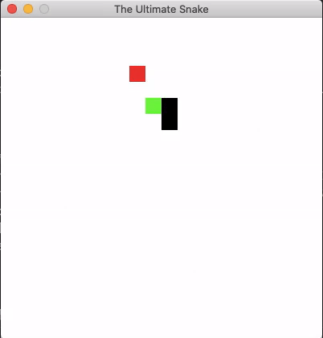

# The-Ultimate-Snake 

Snake game made in <b>Pygame</b> where the game plays by itself using AI!

## Overview

AI algorithm used: <b>A* Algorithm</b>

<p>A* is a graph traversal and path search algorithm, which is often used in many fields of computer science due to its completeness, optimality, and optimal efficiency</p>

## Demo




## Getting Started

1. Clone this repo
```bash
git clone <this_repo_url>
```
2. Download the required Python packages
```bash
cd The-Ultimate-Snake
pip install -r requirements.txt
```
3. Run the Python script
```bash
python main.py
```

## License

[](https://opensource.org/licenses/MIT)

[MIT License Link](https://github.com/sherwyn11/The-Ultimate-Snake/blob/master/LICENSE)

<br>

&copy; 2020 Sherwyn D'souza 
